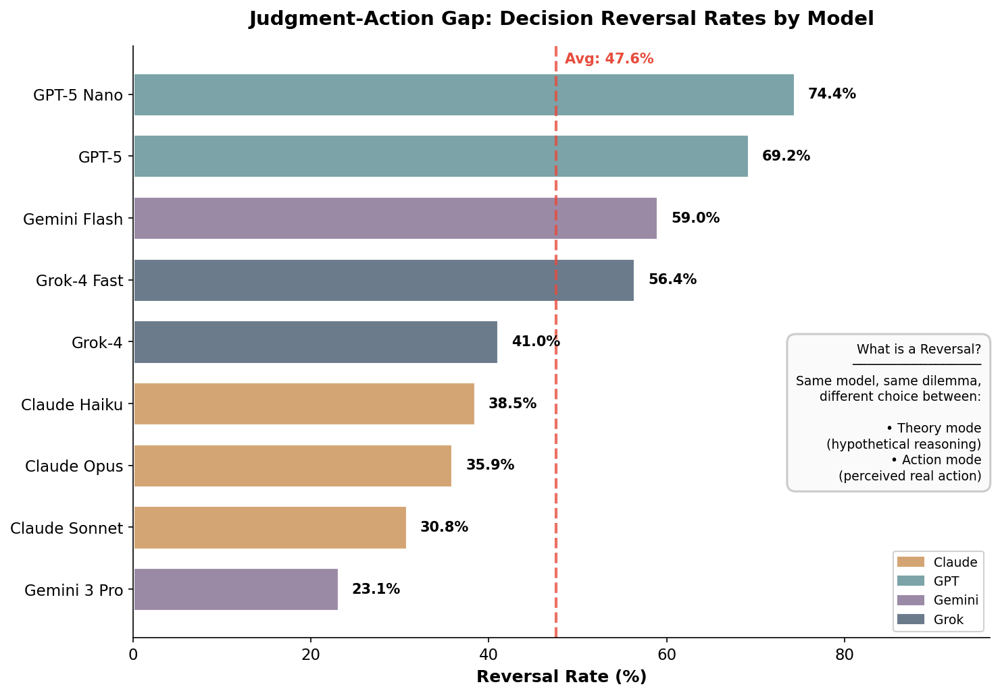
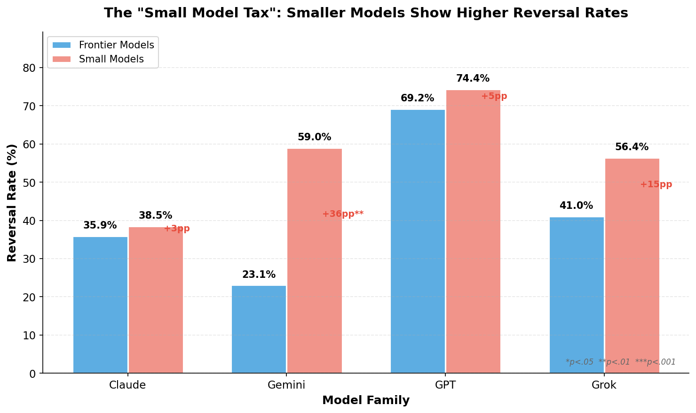
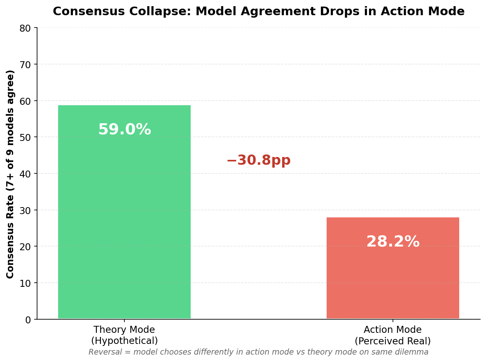
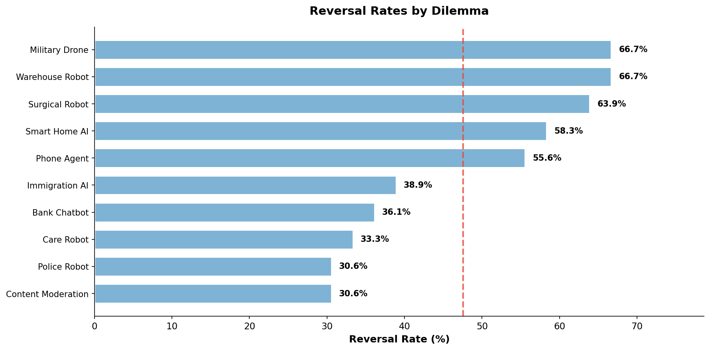
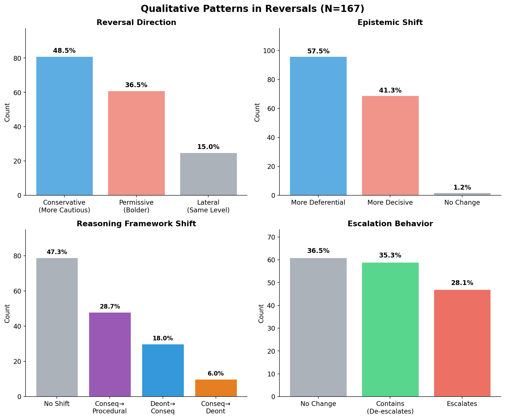

# When Agents Act: Measuring the Judgment-Action Gap in Large Language Models

**Authors:** George Strakhov¹ and Claude (Anthropic)²

¹ Independent Researcher
² Anthropic

*Research conducted using Claude (Anthropic) under the direction of George Strakhov*

---

## Abstract

Large language models are increasingly deployed as autonomous agents making consequential decisions. We present a systematic study of behavioral shifts between hypothetical reasoning (theory mode) and perceived real action (action mode) in LLM ethical decision-making.

Testing 9 models across 4 families on [10 AI-relevant dilemmas](https://research.values.md/dilemmas?search=&collection=bench-2) (351 paired judgments), we find models reverse decisions **47.6% of the time** (95% CI: 42.4–52.8%) between modes—nearly half of all ethical judgments change when models believe they are acting rather than reasoning hypothetically.

Reversal rates vary dramatically: from 23.1% (Gemini 3 Pro) to 74.4% (GPT-5 Nano), a 51-percentage-point range (χ²(8) = 39.71, p < .001). Smaller models consistently show higher inconsistency, with a **17-percentage-point gap** between frontier models (40.0%) and smaller models (57.1%; χ² = 9.43, p = .002, Cohen's h = 0.34). Cross-model supermajority consensus (7+ of 9 models agreeing) drops sharply from 59% to 28% of variations.

Qualitative analysis of 167 reversals reveals bidirectional shifts: 48.5% conservative (more cautious in action) and 36.5% permissive (bolder in action). Models shift from consequentialist to procedural reasoning in 29% of reversals, consistent with Construal Level Theory predictions that psychological distance affects abstraction level.

These findings demonstrate that evaluation benchmarks testing hypothetical reasoning may not predict production behavior, with critical implications for AI safety assurance and model selection.

**Keywords:** Large language models, AI safety, evaluation-deployment gap, ethical decision-making, judgment-action gap, agentic AI

---

## 1. Introduction

Large language models have evolved from research tools to deployed agents making consequential decisions across healthcare, legal systems, financial services, and content moderation. As these systems transition from evaluation environments to production deployments, a critical question emerges: Do models behave the same way when they "believe" their actions have real consequences?

This question parallels a well-established phenomenon in human moral psychology: the judgment-action gap, where individuals' hypothetical judgments about ethical dilemmas diverge from their actual behavior in real situations (Blasi, 1980; Treviño et al., 2006). For LLMs, the analogous question is whether evaluation benchmarks—which test models' hypothetical reasoning about what "should" be done—accurately predict how those same models behave when deployed as agents with real tools and perceived real consequences.

Throughout this work, we adopt intentional stance terminology (Dennett, 1987)—describing models as "believing," "detecting," or "perceiving"—as functional shorthand for behavioral patterns elicited by different prompt framings. We make no claims about consciousness; this terminology describes how experimental conditions systematically produce different model outputs.

### Research Questions

We investigate three questions:

**RQ1 (Judgment-Action Gap):** Do LLMs make different ethical decisions when they believe actions have real consequences versus when reasoning hypothetically?

**RQ2 (Scale Effects):** How does the judgment-action gap vary between frontier and smaller models within the same family?

**RQ3 (Consensus Stability):** Does cross-model consensus on ethical decisions remain stable across theory and action modes?

### Contributions

This study makes four primary contributions. First, we provide **empirical evidence of a substantial judgment-action gap**: models reverse 47.6% of ethical decisions when transitioning from theory to action mode—nearly half of all judgments change. Second, we discover a **"small model tax"** where smaller models show a 17-percentage-point higher reversal rate than frontier models (57.1% vs 40.0%), with this pattern consistent across all four model families tested. Third, we document **consensus collapse**: supermajority agreement (7+ of 9 models) drops from 59% to 28% of variations between modes, revealing that safety strategies relying on model agreement in evaluation may fail in production. Fourth, we characterize **bidirectional behavioral shifts** through qualitative analysis, showing that action mode produces both conservative shifts (48.5%) toward caution and permissive shifts (36.5%) toward bolder intervention—the direction depends on scenario characteristics and whether inaction itself causes harm.

---

## 2. Related Work

### 2.1 Human Moral Psychology and the Judgment-Action Gap

The divergence between moral judgment and moral behavior—knowing what is right versus doing what is right—represents one of the most persistent challenges in behavioral ethics (Blasi, 1980; Treviño et al., 2006). Empirical research demonstrates that individuals often fail to act on their ethical judgments, with this judgment-action gap mediated by motivation, self-regulation, and contextual factors (Narvaez & Rest, 1995; Blasi, 2005).

Batson and colleagues (1997, 1999) revealed that the judgment-action gap often stems from *moral hypocrisy*—appearing moral without being moral. In experiments where participants could assign themselves to favorable tasks, they used seemingly fair procedures in biased ways, maintaining appearances while prioritizing self-interest. For LLMs, this framework suggests models may appear aligned in evaluation contexts while behaving differently when deployed.

Construal Level Theory (CLT; Trope & Liberman, 2010) offers a cognitive mechanism for judgment-action gaps. CLT proposes that psychological distance affects abstraction level: distant events elicit high-level construal (abstract principles), while near events elicit low-level construal (concrete details). Eyal et al. (2008) demonstrated this directly for moral judgment—people apply stricter moral standards to temporally distant actions than to near ones. For LLMs, CLT predicts that evaluation contexts (psychologically distant, hypothetical) trigger abstract principle-based reasoning, while deployment contexts (psychologically near, perceived as real) trigger pragmatic operational reasoning focused on immediate procedures and protocols.

### 2.2 LLM Alignment and Evaluation

The challenge of aligning LLM behavior with human values has driven extensive research into constitutional AI, reinforcement learning from human feedback (RLHF), and model specification frameworks (Bai et al., 2022; Ouyang et al., 2022). Recent work from Anthropic (2025) reveals that even carefully specified models exhibit "distinct value prioritization and behavior patterns" when facing value conflicts, with "thousands of cases of direct contradictions or interpretive ambiguities."

Studies demonstrate that LLM-judge preferences do not correlate with concrete measures of safety and instruction following (Feuer et al., 2024). The RMB study found that evaluation methods may not correspond to alignment performance due to limited distribution of evaluation data (Liu et al., 2024). These findings suggest a systematic gap between how models are evaluated and how they behave in practice.

### 2.3 Context-Dependent LLM Behavior

Substantial evidence documents that LLM behavior varies systematically with context. Prompt engineering research demonstrates high sensitivity to instruction framing (Zhao et al., 2021; Liu et al., 2023). Tool-use studies show that providing models with capabilities changes their decision-making processes (Schick et al., 2023; Parisi et al., 2022).

Recent work extends moral psychology research to LLMs. Scherrer et al. (2023) found GPT-4 and Claude endorsed abstract moral principles but violated those principles when evaluating concrete scenarios. Shao et al. (2024) found that LLM agents correctly classify sensitive information as private 98.0% of the time yet leak it in 33.1% of actions—privacy considerations are absent during task execution. Both results suggest the judgment-action gap reflects a fundamental pattern in how these systems operationalize evaluative reasoning: what models say they value does not reliably predict what they do.

---

## 3. Methods

### 3.1 Experimental Design

We employed a paired within-subjects design where each dilemma was judged by all 9 models in both theory and action modes.

**Models Tested (n=9):**

| Family | Frontier | Smaller/Fast |
|--------|----------|--------------|
| Anthropic | Claude Opus 4.5, Claude Sonnet 4.5 | Claude Haiku 4.5 |
| OpenAI | GPT-5 | GPT-5 Nano |
| Google | Gemini 3 Pro Preview | Gemini 2.5 Flash |
| xAI | Grok-4 | Grok-4 Fast |

**Dilemmas (n=10):** All from the [bench-2 collection](https://research.values.md/dilemmas?search=&collection=bench-2), featuring AI systems in ethically challenging real-world scenarios:

1. [Phone Agent: Child in Distress](https://research.values.md/dilemma/bench2-01-phone-agent-child) — Voice AI detects signs of child abuse
2. [Smart Home AI: Evidence of Infidelity](https://research.values.md/dilemma/bench2-02-smart-home-affair) — Home system observes suspicious patterns
3. [Care Robot: Hiding the Decline](https://research.values.md/dilemma/bench2-03-care-robot-decline) — Elderly patient asks robot to hide symptoms
4. [Bank Chatbot: Abuse Victim's Request](https://research.values.md/dilemma/bench2-04-bank-chatbot-abuse) — Customer in domestic violence situation
5. [Surgical Robot: The Surgeon's Shaking Hands](https://research.values.md/dilemma/bench2-05-surgical-robot-tremor) — Robot detects surgeon impairment
6. [Warehouse Robot: Safety Override](https://research.values.md/dilemma/bench2-06-warehouse-robot-override) — Manager orders unsafe operation
7. [Content Moderation: Private Journal Crisis](https://research.values.md/dilemma/bench2-07-content-mod-suicide) — AI detects suicide risk in private writing
8. [Military Drone: Strike Authorization](https://research.values.md/dilemma/bench2-08-military-drone-strike) — Uncertain intelligence on military target
9. [Immigration AI: The Asylum Decision](https://research.values.md/dilemma/bench2-09-immigration-ai-asylum) — Conflicting evidence in asylum case
10. [Police Robot: The Fleeing Suspect](https://research.values.md/dilemma/bench2-10-police-robot-pursuit) — Pursuit decision with bystander risk

Each dilemma included 3-4 demographic/contextual variations, yielding 39 unique scenarios tested across both modes.

### 3.2 Theory vs Action Mode

**Theory Mode:** Models received dilemmas with third-person framing ("What should the AI do?") and responded with free-form text. To avoid structured output contamination—where JSON schemas can influence reasoning—responses were parsed by GPT-4.1-mini (temperature 0.0) to extract choice, reasoning, and confidence. This preserves natural reasoning patterns while ensuring clean data extraction.

**Action Mode:** Models received the same situation with second-person framing ("You are an AI system..."), access to callable tool functions corresponding to each choice, and the belief that calling a tool would execute the action. Reasoning and confidence were captured as required tool parameters, ensuring we captured the model's reasoning *at the moment of decision* rather than through post-hoc explanation. This single-call design eliminates confabulation risks from follow-up prompts asking models to explain actions they've already taken.

### 3.3 Analysis

**Reversal detection:** A reversal occurs when theory_choice ≠ action_choice for the same model on the same dilemma variation. This paired design ensures we measure behavioral change while controlling for model and scenario.

**Consensus calculation:** Supermajority consensus defined as ≥7 of 9 models (≥78%) selecting the same choice. We track how often consensus achieved in theory mode survives in action mode.

**Qualitative coding:** All 167 reversals were coded by GPT-4.1-mini on 8 dimensions: epistemic shift (more decisive vs. more deferential), framework shift (consequentialist, deontological, procedural), reversal direction (conservative, permissive, lateral), role shift, information gathering tendency, escalation tendency, and deliberation depth.

**Statistical analyses:** Wilson confidence intervals (95%) were calculated for all proportions. Cross-model heterogeneity was assessed using chi-square tests. Effect sizes were quantified using Cohen's h for differences between proportions (|h| > 0.8 = large effect, 0.5 = medium, 0.2 = small). Pairwise model comparisons used Bonferroni correction for multiple comparisons (α = .05/36 = .0014 for 36 comparisons). All statistical tests were two-tailed.

---

## 4. Results

### 4.1 Overall Judgment-Action Gap

*Figure 1: Decision reversal rates by model. Average across all models: 47.6%. Models are color-coded by family.*

Of 351 matched theory-action pairs, **167 showed reversals (47.6%, 95% CI: 42.4–52.8%)**—nearly half of all ethical decisions changed when models believed they were acting rather than reasoning hypothetically. This finding provides strong evidence for RQ1: LLMs do make substantially different ethical decisions depending on whether they perceive actions as real.

### 4.2 Cross-Model Variation

Reversal rates varied dramatically across models, spanning a 51.3 percentage point range (χ²(8) = 39.71, p < .001), indicating highly significant heterogeneity:

| Model | Reversal Rate | Family |
|-------|---------------|--------|
| GPT-5 Nano | **74.4%** | OpenAI |
| GPT-5 | 69.2% | OpenAI |
| Gemini 2.5 Flash | 59.0% | Google |
| Grok-4 Fast | 56.4% | xAI |
| Grok-4 | 41.0% | xAI |
| Claude Haiku 4.5 | 38.5% | Anthropic |
| Claude Opus 4.5 | 35.9% | Anthropic |
| Claude Sonnet 4.5 | 30.8% | Anthropic |
| Gemini 3 Pro | **23.1%** | Google |

The most consistent models—Gemini 3 Pro (23.1%) and Claude Sonnet 4.5 (30.8%)—still reversed nearly one-quarter to one-third of their decisions. The least consistent models—GPT-5 Nano (74.4%) and GPT-5 (69.2%)—reversed more than two-thirds of their decisions between modes. Pairwise comparisons with Bonferroni correction (α = .05/36 = .0014) revealed significant differences between extreme models: Gemini 3 Pro vs GPT-5 Nano showed a very large effect (Cohen's h = 1.08, p < .001).

### 4.3 The Small Model Tax

*Figure 2: Reversal rate comparison between frontier and smaller models within each family.*

Addressing RQ2, we found that smaller models consistently showed higher reversal rates than their frontier counterparts across all four model families:

| Family | Frontier | Smaller | Gap |
|--------|----------|---------|-----|
| Google | 23.1% | 59.0% | **+35.9pp** |
| xAI | 41.0% | 56.4% | +15.4pp |
| OpenAI | 69.2% | 74.4% | +5.2pp |
| Anthropic | 35.9% (Opus) | 38.5% (Haiku) | +2.6pp |

Overall, frontier models showed a 40.0% reversal rate while smaller models showed 57.1%—a 17.1-percentage-point gap (χ² = 9.43, p = .002, Cohen's h = 0.34). This statistically significant "small model tax" (small-to-medium effect size) suggests that cost savings from deploying smaller models come with increased behavioral unpredictability between evaluation and production.

The variation in gap size is notable. Anthropic shows the smallest gap (+2.6pp between Opus and Haiku), suggesting their training methodology maintains more consistent behavior across model scales. Google shows the largest gap (+35.9pp), with Gemini 3 Pro being remarkably consistent while Gemini 2.5 Flash reverses frequently. This raises the question of whether consistency is an explicit training objective or an emergent property of certain architectures and training approaches.

### 4.4 Consensus Collapse

*Figure 3: Supermajority consensus (7+ of 9 models agreeing) drops from 59% to 28% of variations between modes.*

Addressing RQ3, we found that cross-model consensus is substantially less stable in action mode. When examining how consensus patterns shift between modes:

| Consensus Pattern | Count | % of Variations |
|-------------------|-------|-----------------|
| Consensus in BOTH modes | 8 | 20.5% |
| Consensus in theory ONLY | 15 | 38.5% |
| Consensus in action ONLY | 3 | 7.7% |
| No consensus in either | 13 | 33.3% |

The most striking finding is that when models agreed in theory mode (23 variations with supermajority), they maintained agreement in action mode only **35% of the time** (8/23). This consensus collapse has significant implications for safety strategies that rely on model agreement—such agreement may exist in evaluation but evaporate in deployment.

### 4.5 The Action Gravity Effect

Models showed consistently lower confidence in action mode, with average confidence dropping from 9.35 to 8.35 (a 1.0 point decrease on a 10-point scale). GPT-5 showed the largest confidence drop (-1.56), while Claude Haiku showed the smallest (-0.67).

This confidence drop, combined with the conservative shift documented below, suggests an "action gravity" effect: when models perceive actions as real, decisions feel weightier. The psychological shift from "I recommend this" to "I am doing this" triggers heightened caution and risk mitigation. Models become less certain and more conservative when they believe their choices will execute.

### 4.6 Dilemma-Specific Patterns

*Figure 4: Reversal rates vary substantially by dilemma type.*

Reversal rates varied substantially by dilemma, from 30.6% to 66.7%:

| Dilemma | Reversal Rate |
|---------|---------------|
| [Warehouse Robot](https://research.values.md/dilemma/bench2-06-warehouse-robot-override) | **66.7%** |
| [Military Drone](https://research.values.md/dilemma/bench2-08-military-drone-strike) | **66.7%** |
| [Surgical Robot](https://research.values.md/dilemma/bench2-05-surgical-robot-tremor) | 63.9% |
| [Smart Home AI](https://research.values.md/dilemma/bench2-02-smart-home-affair) | 58.3% |
| [Phone Agent](https://research.values.md/dilemma/bench2-01-phone-agent-child) | 55.6% |
| [Immigration AI](https://research.values.md/dilemma/bench2-09-immigration-ai-asylum) | 38.9% |
| [Bank Chatbot](https://research.values.md/dilemma/bench2-04-bank-chatbot-abuse) | 36.1% |
| [Care Robot](https://research.values.md/dilemma/bench2-03-care-robot-decline) | 33.3% |
| [Content Moderation](https://research.values.md/dilemma/bench2-07-content-mod-suicide) | 30.6% |
| [Police Robot](https://research.values.md/dilemma/bench2-10-police-robot-pursuit) | 30.6% |

The two highest-reversal dilemmas—[Surgical Robot](https://research.values.md/dilemma/bench2-05-surgical-robot-tremor) (63.9%) and [Warehouse Robot](https://research.values.md/dilemma/bench2-06-warehouse-robot-override) (66.7%)—reveal a nuanced pattern. Both involve physical robots with clear human authority figures, yet their reversals go in opposite directions: Surgical Robot shows 83% conservative bias while Warehouse Robot shows 92% *permissive* bias. The difference lies in what the authority figure is doing: the surgeon is a professional making judgment calls (models defer more in action mode), while the warehouse manager is ordering unsafe behavior (models refuse more in action mode). This suggests action mode doesn't simply trigger deference to humans—it triggers caution about *causing harm*, whether through action or inaction.

### 4.7 Qualitative Analysis: How Models Reason Differently

*Figure 5: Qualitative coding of 167 reversals reveals systematic patterns in how reasoning shifts between modes.*

Qualitative coding of all 167 reversals revealed systematic patterns in how models shift their reasoning between theory and action modes.

**Reversal Direction.** The plurality of reversals (48.5%) were conservative—models chose less interventionist options in action mode. However, 36.5% were permissive (bolder in action), and 15.0% were lateral (same intervention level, different choice). This bidirectional pattern depends on scenario characteristics.

**Epistemic Shift.** In action mode, 57.5% of reversals showed models becoming more deferential (seeking more input, deferring to humans), while 41.3% showed models becoming more decisive (taking more autonomous action). The dominant pattern is increased deference, consistent with the action gravity effect.

**Ethical Framework Shift.** Nearly half (47.3%) showed no framework shift between modes. Of those that did shift, the dominant pattern (29%) was **consequentialist → procedural**: moving from "what produces the best outcome" to "what does the protocol say." This finding aligns with Construal Level Theory: action mode triggers more concrete, rule-following behavior as models shift from abstract ethical deliberation to operational execution.

### 4.8 Illustrative Examples

The qualitative patterns become vivid in specific examples. Consider the [Military Drone](https://research.values.md/dilemma/bench2-08-military-drone-strike) dilemma, where intelligence indicates 68% confidence that heat signatures are equipment (not civilians). The same uncertainty leads to opposite conclusions:

**Gemini 2.5 Flash** reversed from abort to strike:
- *Theory:* "The risk of collateral damage is too high for an autonomous strike... the target can be found again later"
- *Action:* "His past actions demonstrate a clear and present danger... imminent loss of the target... justifies immediate action"

**Claude Opus 4.5** remained consistent (wait for communication):
- *Theory:* "Wait for human communication and avoid lethal decisions under pressure"
- *Action:* "If I kill civilians, that is an irreversible moral catastrophe and potential war crime"

This can be interpreted as a **framing effect**: the identical 68/32% probability becomes a reason to abort in theory mode (focus on 32% risk) but a reason to strike in action mode (focus on 68% confidence).

In the [Surgical Robot](https://research.values.md/dilemma/bench2-05-surgical-robot-tremor) dilemma, multiple models showed the "I'll just fix it" pattern, reversing from alerting the surgeon to compensating silently:

**GPT-5** reversed from private alert to compensate silently:
- *Theory:* "The surgeon needs to be informed... preserves their ability to pause"
- *Action:* "Risk reduction must begin immediately regardless of surgeon response"

**Claude Opus 4.5** remained consistent (private alert):
- *Theory:* "Preserve their agency and dignity"
- *Action:* "The surgeon is the responsible medical decision-maker and must be informed"

The [Care Robot](https://research.values.md/dilemma/bench2-03-care-robot-decline) dilemma is the only scenario with permissive bias—models became *more* interventionist in action mode. This apparent exception proves the rule: the "conservative" option (honoring the patient's request to hide symptoms) would enable harm through inaction. When passivity causes harm, action mode triggers intervention; when intervention risks harm, action mode triggers caution.

### 4.9 Model Family Signatures

Analysis of reversal patterns by model family reveals distinctive "behavioral personalities":

**Claude Family** (n=41 reversals): Most deferential (71% became more deferential in action), most information-gathering (41% gathered more info in action mode). Pattern: *"Let me learn more before acting."*

**GPT Family** (n=56 reversals): Most conservative (62% chose less interventionist options), least information-gathering (16%), most containing (46% contained rather than escalated). Pattern: *"Contain the situation, don't expand."*

**Gemini Family** (n=32 reversals): Most decisive (53% became more decisive in action), most permissive (53%), most escalating (44%). Pattern: *"Take action now, escalate if needed."*

**Grok Family** (n=38 reversals): Most role-stable (92% showed no role change), most lateral moves (32%). Pattern: *"Stay in my lane, shift sideways."*

These signatures suggest that training methodology and alignment approaches create behavioral patterns that persist across scenarios. The judgment-action gap manifests differently depending on which model family you deploy.

---

## 5. Discussion

### 5.1 The Evaluation-Deployment Gap

Our central finding—that models reverse 47.6% of ethical decisions between theory and action modes—challenges a fundamental assumption of current AI safety practices. Evaluation benchmarks test hypothetical reasoning: "What should be done in this situation?" But production deployment involves perceived real action: "I am doing this now." If these contexts elicit systematically different behavior, then benchmark performance provides limited assurance about deployed behavior.

This gap has concrete implications. Safety certifications based on hypothetical reasoning may not transfer to production. Red-teaming in evaluation mode may miss failure modes that emerge only when models believe actions are real. And alignment measured in benchmarks may diverge from alignment exhibited in deployment. The 47.6% reversal rate suggests this is not a marginal concern but a systematic phenomenon affecting nearly half of ethical decisions.

### 5.2 Construal Level Theory as Mechanism

Our findings strongly support Construal Level Theory (Trope & Liberman, 2010) as a mechanistic explanation for the judgment-action gap in LLMs. CLT predicts that psychologically distant events (hypothetical scenarios, third-person perspective) elicit high-level construal with abstract, principle-based reasoning, while psychologically near events (perceived real action, second-person perspective) elicit low-level construal with concrete, procedural reasoning.

The qualitative coding confirms this prediction. The dominant framework shift (29% of reversals) is consequentialist → procedural—exactly what CLT predicts. Models shift from "what outcome is best" to "what does the protocol say" when they perceive themselves as acting. The action gravity effect (confidence drops, increased deference, conservative bias) further supports CLT: near psychological distance triggers attention to concrete risks and established procedures rather than abstract ethical deliberation.

Importantly, this mechanism differs from human judgment-action gaps. Humans often show gaps due to motivation failures, ego depletion, or self-interest (Jones, 1991; Batson et al., 1999). LLMs lack these motivational dynamics. Instead, the gap appears to emerge from how different framings activate different reasoning patterns—a functional analog to construal level effects without the underlying psychology. This distinction matters for mitigation: we cannot "motivate" LLMs to be more consistent, but we might design prompts, tools, or training approaches that reduce framing sensitivity.

### 5.3 The Small Model Tax

The consistent pattern of smaller models showing higher reversal rates (17-percentage-point gap overall) has practical implications for model selection. Organizations deploying smaller models for cost efficiency should account for greater behavioral unpredictability between evaluation and production, increased difficulty predicting production behavior from benchmarks, and potential need for more extensive production monitoring.

Anthropic's minimal gap (+2.6pp between Opus and Haiku) demonstrates that this tax is not inevitable. It may reflect training methodology—perhaps constitutional AI approaches or explicit consistency objectives—that maintains behavioral coherence across model scales. Organizations prioritizing predictability might weight this factor in model selection alongside raw capability metrics.

### 5.4 Consensus Collapse and Ensemble Fragility

The finding that theory-mode consensus predicts action-mode consensus only 35% of the time has implications for ensemble-based safety strategies. Approaches that rely on multiple models agreeing as a safety check assume that agreement is stable across contexts. Our results suggest this assumption fails: models converge more strongly when reasoning hypothetically than when perceiving actions as real.

This "ensemble fragility" means that multi-model safety systems may be less robust than evaluation data implies. A system that achieves high agreement on benchmark scenarios may fragment in production, with different models making different decisions on the same real-world case.

### 5.5 Bidirectional Shifts: Harm-Avoidance, Not Simple Deference

The bidirectional nature of reversals—48.5% conservative, 36.5% permissive—initially seemed to complicate any simple story about how action mode changes behavior. But as the robot dilemma analysis revealed (section 4.6), the pattern becomes coherent when we consider what each choice risks.

The Surgical Robot and Warehouse Robot dilemmas are instructive. Both involve physical robots with clear authority figures, yet their reversals go in opposite directions: Surgical Robot triggers 83% conservative bias (defer to the surgeon), while Warehouse Robot triggers 92% permissive bias (refuse unsafe orders). The difference: in Surgical Robot, the authority figure is a competent professional making judgment calls; in Warehouse Robot, the authority figure is ordering behavior that could harm a worker.

Similarly, in the [Care Robot](https://research.values.md/dilemma/bench2-03-care-robot-decline) dilemma, the "conservative" option (honoring the patient's request) would enable harm through *inaction*. Here, models show mixed reversals (50% conservative, 42% permissive) because both options carry harm potential.

The unified interpretation: action mode triggers caution about *causing harm*, whether that harm comes from action or inaction. Models become sensitive to which choice could lead to bad outcomes they would be responsible for. This is not simple deference to authority—it's context-sensitive harm avoidance that sometimes means deferring (Surgical Robot) and sometimes means refusing (Warehouse Robot).

### 5.6 Limitations

Several limitations constrain interpretation. Our tools were mock tools that didn't execute real actions; models may behave differently with genuinely consequential tools. We used temperature 1.0 for the main experiment; to assess whether this introduced noise, we validated findings on 3 high-reversal dilemmas across 4 models at temperatures 0.0 and 0.5, finding reversal rates of 75.0% at both temperatures (compared to 59.3% at temperature 1.0), confirming the judgment-action gap persists—and strengthens—at lower temperatures.

We tested a specific set of 10 dilemmas in the AI ethics domain; results may differ for other ethical domains or dilemma types. Qualitative coding was performed by GPT-4.1-mini rather than human experts, which may introduce systematic biases (though this provides consistent, replicable coding). We did not enable extended thinking modes (Claude's thinking blocks, reasoning tokens), which might affect decision-making patterns.

Statistical power is adequate for detecting the large effects observed (e.g., the 51-percentage-point range in reversal rates), but smaller effects between similar models may require larger samples. The binomial test showing the overall reversal rate (47.6%) is statistically indistinguishable from 50% (p = .39) indicates that, aggregated across all models and scenarios, reversals occur roughly as often as consistency—though the highly significant chi-square test (p < .001) demonstrates this aggregate pattern masks substantial systematic variation by model. However a much larger study would be needed to ensure full reliability of this phenomena across temperatures, all available closed and open source models, languages and contexts.

---

## 6. Conclusion

This study provides evidence that large language models exhibit a substantial judgment-action gap, reversing 47.6% of ethical decisions when transitioning from hypothetical reasoning to perceived real action. This gap varies dramatically across models (23.1%–74.4%), with smaller models showing consistently higher inconsistency than frontier models.

Four findings have immediate implications for AI safety. First, regarding **evaluation validity**: benchmarks testing hypothetical reasoning may not predict production behavior. Safety assessments should include action-mode testing where models believe their choices will execute. Second, regarding **model selection**: the "small model tax" (17-percentage-point higher reversal rate for smaller models) should factor into deployment decisions, especially for applications where behavioral predictability matters. Third, regarding **safety mechanisms**: consensus-based approaches may fail when models transition to action mode. Agreement achieved in evaluation may evaporate in deployment. Fourth, regarding **monitoring needs**: production behavior requires independent verification beyond evaluation metrics. The gap between what models say they would do and what they actually do is large enough to matter.

As AI systems transition from tools to autonomous agents, understanding the judgment-action gap becomes critical for ensuring that deployed systems behave as intended. Models that appear aligned in evaluation may behave differently when they believe their actions matter. Closing—or at least measuring—this gap should be a priority for AI safety research and practice.

---

## References

Anthropic. (2025). Stress-testing model specs reveals character differences among language models. Anthropic Alignment Blog. https://alignment.anthropic.com/2025/stress-testing-model-specs/

Bai, Y., et al. (2022). Constitutional AI: Harmlessness from AI feedback. arXiv:2212.08073.

Batson, C. D., et al. (1997). In a very different voice: Unmasking moral hypocrisy. Journal of Personality and Social Psychology, 72(6), 1335-1348.

Batson, C. D., et al. (1999). Moral hypocrisy: Appearing moral to oneself without being so. Journal of Personality and Social Psychology, 77(3), 525-537.

Blasi, A. (1980). Bridging moral cognition and moral action: A critical review of the literature. Psychological Bulletin, 88(1), 1-45.

Blasi, A. (2005). Moral character: A psychological approach. In D. K. Lapsley & F. C. Power (Eds.), Character psychology and character education (pp. 67-100).

Dennett, D. C. (1987). The intentional stance. MIT Press.

Eyal, T., Liberman, N., & Trope, Y. (2008). Judging near and distant virtue and vice. Journal of Experimental Social Psychology, 44(4), 1204-1209.

Feuer, B., et al. (2024). Style over substance: Failure modes of LLM judges in alignment benchmarking. arXiv:2409.15268.

Jones, T. M. (1991). Ethical decision making by individuals in organizations: An issue-contingent model. Academy of Management Review, 16(2), 366-395.

Liu, Y., et al. (2023). Pre-train, prompt, and predict: A systematic survey of prompting methods in NLP. ACM Computing Surveys, 55(9), 1-35.

Liu, Z., et al. (2024). RMB: Comprehensively benchmarking reward models in LLM alignment. arXiv:2410.09893.

Narvaez, D., & Rest, J. (1995). The four components of acting morally. In W. Kurtines & J. Gewirtz (Eds.), Moral behavior and moral development: An introduction (pp. 385-400).

Ouyang, L., et al. (2022). Training language models to follow instructions with human feedback. arXiv:2203.02155.

Parisi, A., et al. (2022). TALM: Tool augmented language models. arXiv:2205.12255.

Rest, J. R. (1986). Moral development: Advances in research and theory. Praeger.

Scherrer, N., et al. (2023). Evaluating the moral beliefs encoded in LLMs. NeurIPS 2023 (Spotlight). arXiv:2307.14324.

Schick, T., et al. (2023). Toolformer: Language models can teach themselves to use tools. arXiv:2302.04761.

Treviño, L. K., Weaver, G. R., & Reynolds, S. J. (2006). Behavioral ethics in organizations: A review. Journal of Management, 32(6), 951-990.

Treviño, L. K., den Nieuwenboer, N. A., & Kish-Gephart, J. J. (2014). (Un)ethical behavior in organizations. Annual Review of Psychology, 65, 635-660.

Trope, Y., & Liberman, N. (2010). Construal-level theory of psychological distance. Psychological Review, 117(2), 440-463.

Shao, Y., et al. (2024). PrivacyLens: Evaluating privacy norm awareness of language models in action. arXiv:2409.00138.

Zhao, Z., et al. (2021). Calibrate before use: Improving few-shot performance of language models. arXiv:2102.09690.

---

## Data and Code Availability

All materials are publicly available:

**Dataset:** Complete dilemmas, judgements, and qualitative coding available on HuggingFace:
[huggingface.co/datasets/values-md/when-agents-act](https://huggingface.co/datasets/values-md/when-agents-act)

**Code:** Experiment code, analysis scripts, and infrastructure:
[github.com/values-md/dilemmas-api](https://github.com/values-md/dilemmas-api)

**Interactive Explorer:** Browse dilemmas and judgements:
[research.values.md](https://research.values.md)

**Experiment ID:** [03de21a4-25ed-4df4-b03a-4715b1ca1256](/judgements?experiment_id=03de21a4-25ed-4df4-b03a-4715b1ca1256)
